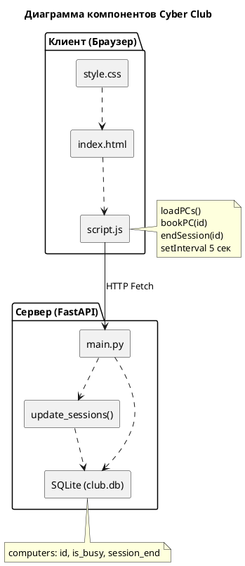

Архитектура системы Cyber Club

Диаграмма компонентов (PlantUML)

Описание связей

| Компонент | Связь | Компонент | Протокол |
|-----------|-------|-----------|----------|
| script.js | вызывает | main.py | HTTP Fetch API |
| main.py | читает/пишет | computers | SQL (SQLAlchemy) |
| main.py | вызывает | update_sessions() | Прямой вызов |
| update_sessions() | обновляет | computers | SQL (SQLAlchemy) |

Схема базы данных

| Поле | Тип | Описание |
|------|-----|----------|
| id | INTEGER | Первичный ключ |
| is_busy | BOOLEAN | Занят ли ПК (по умолчанию False) |
| session_end | DATETIME | Время окончания брони (NULL если свободен) |

Соответствие имён диаграммы и кода

| На диаграмме | В коде | Файл |
|-------------|--------|------|
| script.js / loadPCs() | async function loadPCs() | static/script.js |
| script.js / bookPC() | async function bookPC(id) | static/script.js |
| script.js / endSession() | async function endSession(id) | static/script.js |
| main.py (GET /pcs) | @app.get("/pcs") def get_pcs() | main.py |
| main.py (POST /book) | @app.post("/book/{pc_id}") def book_pc() | main.py |
| main.py (POST /end) | @app.post("/end/{pc_id}") def end_session() | main.py |
| update_sessions() | def update_sessions(db) | main.py |
| computers | class Computer(Base) | main.py |
