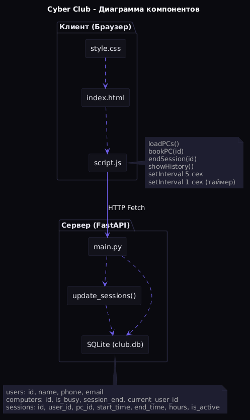

# Архитектура системы Cyber Club

## Диаграмма компонентов (PlantUML)

### Исходный код диаграммы

@startuml
skinparam componentStyle rectangle
skinparam backgroundColor #FFFFFF

title Диаграмма компонентов Cyber Club

package "Клиент (Браузер)" {
    [index.html] as html
    [style.css] as css
    [script.js] as js
    html ..> js
    css ..> html
}

package "Сервер (FastAPI)" {
    [main.py] as api
    [update_sessions()] as updater
    [SQLite (club.db)] as db
    api ..> updater
    api ..> db
    updater ..> db
}

js -down-> api : HTTP Fetch

note right of js
  loadPCs()
  bookPC(id)
  endSession(id)
  showHistory()
  setInterval 5 сек
  setInterval 1 сек (таймер)
end note

note bottom of db
  users: id, name, phone, email
  computers: id, is_busy, session_end, current_user_id
  sessions: id, user_id, pc_id, start_time, end_time, hours, is_active
end note

@enduml

## Описание связей

| Компонент | Связь | Компонент | Протокол |
|-----------|-------|-----------|----------|
| script.js | вызывает | main.py | HTTP Fetch API |
| main.py | читает/пишет | users, computers, sessions | SQL (SQLAlchemy) |
| main.py | вызывает | update_sessions() | Прямой вызов |
| update_sessions() | обновляет | computers, sessions | SQL (SQLAlchemy) |

## Схема базы данных

### Таблица users

| Поле | Тип | Описание |
|------|-----|----------|
| id | INTEGER | Первичный ключ |
| name | STRING | Имя пользователя |
| phone | STRING | Номер телефона (уникальный) |
| email | STRING | Email (опционально) |

### Таблица computers

| Поле | Тип | Описание |
|------|-----|----------|
| id | INTEGER | Первичный ключ |
| is_busy | BOOLEAN | Занят ли ПК |
| session_end | DATETIME | Время окончания брони |
| current_user_id | INTEGER | Внешний ключ на users.id |

### Таблица sessions

| Поле | Тип | Описание |
|------|-----|----------|
| id | INTEGER | Первичный ключ |
| user_id | INTEGER | Внешний ключ на users.id |
| pc_id | INTEGER | Внешний ключ на computers.id |
| start_time | DATETIME | Начало сессии |
| end_time | DATETIME | Конец сессии |
| hours | INTEGER | Количество часов |
| is_active | BOOLEAN | Активна ли сессия |

## Соответствие имён диаграммы и кода

| На диаграмме | В коде | Файл |
|-------------|--------|------|
| script.js | loadPCs(), bookPC(), endSession(), showHistory() | static/script.js |
| main.py | GET /pcs, POST /book, POST /end, GET /history | main.py |
| update_sessions() | def update_sessions(db) | main.py |
| users | class User(Base) | main.py |
| computers | class Computer(Base) | main.py |
| sessions | class Session(Base) | main.py |
